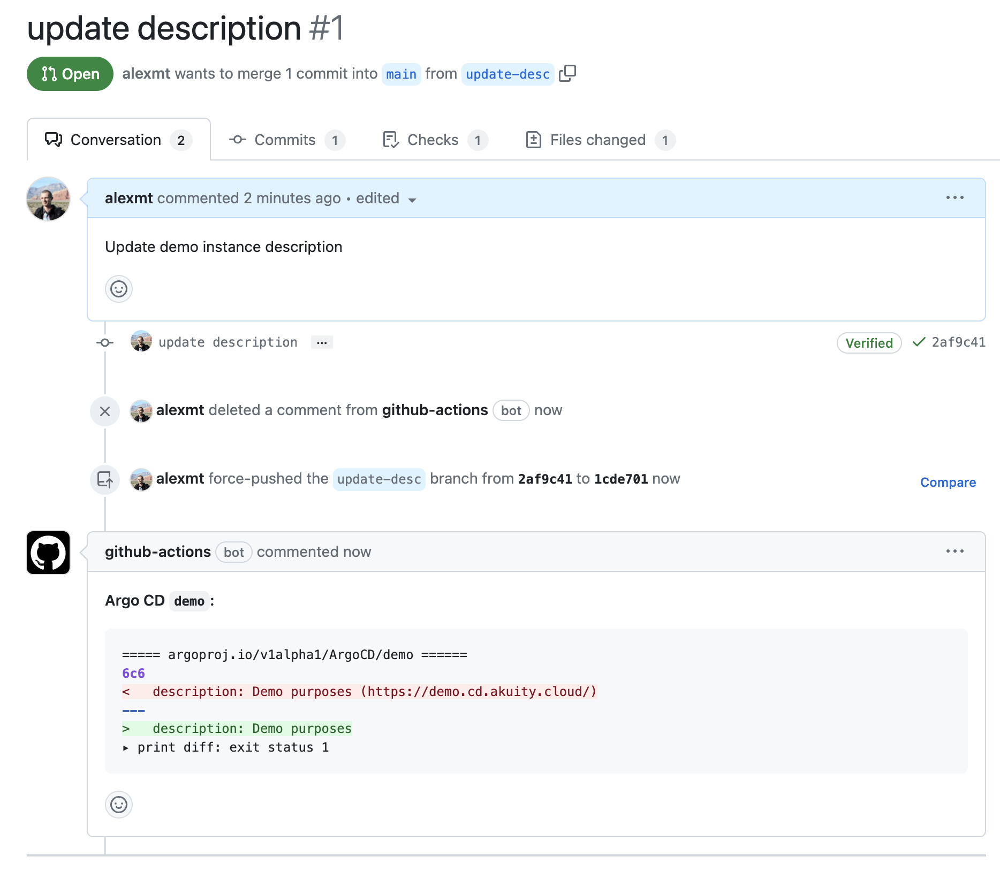

# Akuity Platform Declarative Management

The repository contains the declarative configuration of the Akuity Platform and implements GitOps workflow using GitHub Actions.

## Repository Structure

The repository is organized as follows:

* `argocd` - Contains the declarative configuration of the Argo CD instances.
Currently, there is only one instance of Argo CD, `demo`, which is used to manage the Akuity Platform and is available at https://demo.cd.akuity.cloud/.
* `hack` - Contains a bash script that implements reconciliation workflows and is used by GitHub Actions.
* `.github/workflows` - Contains GitHub Actions workflows that implement GitOps process.

## Manual Management

> Note. You will need to install [git](https://git-scm.com/downloads) and [yq](https://mikefarah.gitbook.io/yq/) and [akuity cli](https://docs.akuity.io/akuity-platform/cli).

The declarative configuration of the Akuity Platform can be performed manually using the [akuity cli](https://docs.akuity.io/akuity-platform/cli). Use the following steps to
start managing existing Argo CD instance managed by the Akuity Platform:

1. Export existing instance configuration using `akuity argocd export <name> --organization-name <org-name>` command:

    > Note. `yq` provides a convenient way to split the output into multiple files.
    
    ```shell
    akuity argocd export demo --organization-name demo | yq -s '.metadata.name' -
    ```

1. Compare local configuration with the current state of the Akuity Platform using `akuity argocd diff <name> --organization-name <org-name>` command:

    ```shell
    akuity argocd diff demo --organization-name demo -f argocd/demo/

    ===== argoproj.io/v1alpha1/ArgoCD/demo ======
    6c6
    <   description: Demo purposes (https://demo.cd.akuity.cloud/)
    ---
    >   description: Demo purposes
    ▸ print diff: exit status 1%
    ```

1. Apply changes to the Akuity Platform using `akuity argocd apply -f <configuration-path>` command:

    ```shell
    akuity argocd apply -f argocd/demo/
    ```

## Automated Workflow

The GitOps workflow is implemented using GitHub Actions and is provides the following experience:

1. Engineers make changes to the declarative configuration of the Akuity Platform in the `argocd` directory and create Pull Request
with the proposed changes.
1. GitHub action workflow compares the proposed changes with the current state of the Akuity Platform and posts detected changes as a comment to the Pull Request.

    

1. Reviewers review the proposed changes and detected changes report and approve the Pull Request.
1. GitHub action workflow applies the proposed changes to the Akuity Platform.
